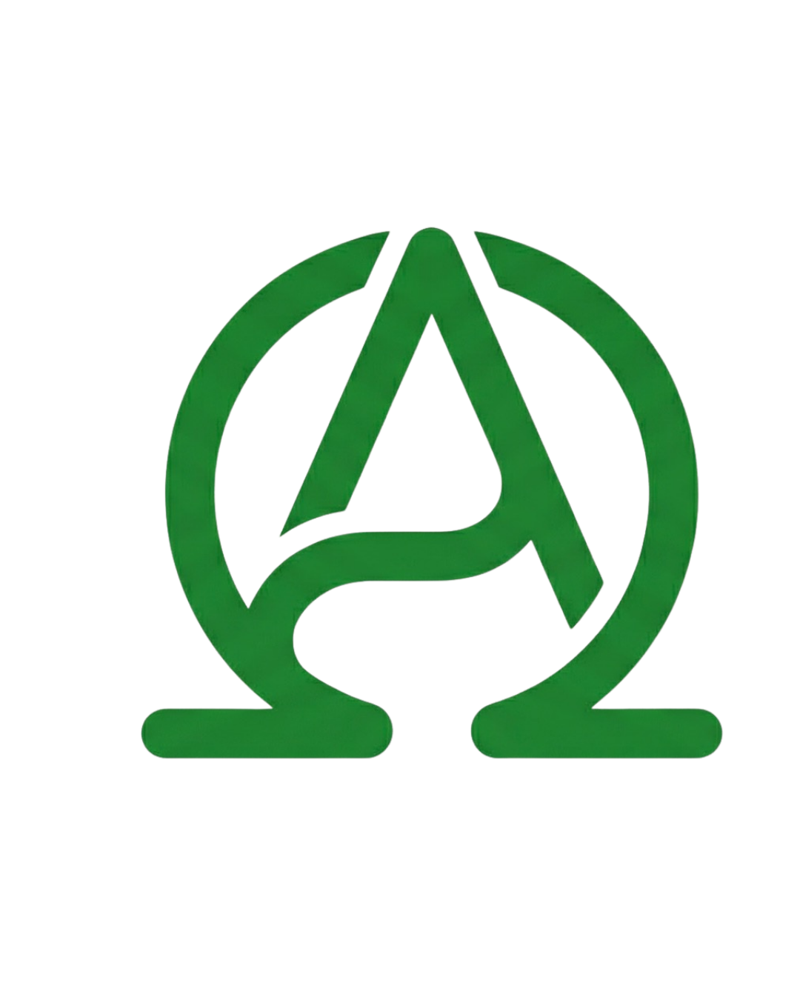

# 🏁 ApexCoach — Full Stack Motorsport AI

**ApexCoach** is a high-performance motorsport telemetry analysis and AI coaching ecosystem. It transforms raw MCAP telemetry from the Yas Marina Formula 1 circuit into actionable, real-time coaching for drivers.



## 🏗️ Ecosystem Architecture

The system consists of three primary components working in sync:

1.  **[ApexCoach Backend](file:///absolute/path/to/apexcoach-backend)**: Python (FastAPI/Numpy) engine that processes MCAP files, aligns laps, and generates AI coaching cues via SSE and OpenAI.
2.  **[Race Line Mentor (Tablet App)](file:///absolute/path/to/race-line-mentor-tablet-main)**: React/Vite dashboard used by coaches/drivers on-track to replay laps, view speed traces, and sync data.
3.  **[Apex Coach Driver (Mobile App)](file:///absolute/path/to/apex-coach-mobile-main)**: React/Vite mobile app for drivers to carry their session data, view reports, and sync via QR codes.

---

## 🚀 Quick Start

### 1. Backend (Python 3.10+)
```bash
cd apexcoach-backend
pip install -r requirements.txt
python main.py
```
*   **API**: `http://localhost:8000`
*   **Key Logic**: MCAP parsing, 1m-grid lap alignment, and trapezoidal time-loss integration.

### 2. Tablet App (Mentor Dashboard)
```bash
cd race-line-mentor-tablet-main
npm install
npm run dev
```
*   **URL**: `http://localhost:8080`
*   **ENV**: `VITE_API_BASE_URL=http://localhost:8000`

### 3. Mobile App (Driver Profile)
```bash
cd apex-coach-mobile-main
npm install
npm run dev
```
*   **URL**: `http://localhost:8081`
*   **ENV**: `VITE_API_BASE_URL=http://localhost:8000`

---

## 🧠 Core Engineering: How it Works

### 1. Lap Alignment & Resampling
Telemetry from different laps cannot be compared by time. ApexCoach resamples all data onto a uniform **1-meter distance grid** (0m → 2451m).
- **Tool**: `aligner.py`
- **Method**: Unrolling lap distance wrap-around and linear interpolation.

### 2. Time Loss Integration
The "Time Gap" is calculated using trapezoidal integration of the velocity difference:
$$\Delta t = \int \left( \frac{1}{v_{user}} - \frac{1}{v_{ref}} \right) ds$$
This provides sub-millisecond accuracy for exactly *where* time is being lost.

### 3. Live Coaching (SSE)
The backend streams frames at 100Hz. For each frame, it look ahead 50m on the reference lap to provide anticipatory cues like *"Brake 12m later"* or *"More entry speed"*.

---

## 📱 Mobile Sync & QR Flow
ApexCoach uses a "Zero-Cloud" sync approach for instant trackside debriefs:
1.  **Tablet** generates a session export URL.
2.  **Tablet** encodes this into a QR code containing the session data.
3.  **Mobile App** scans the QR code and imports the full analysis, charts, and AI report for offline viewing.

---

## 🛠️ Tech Stack

### Backend
- **FastAPI**: High-performance async API.
- **Numpy/Scipy**: Vectorized telemetry processing.
- **MCAP/ROS2**: Industrial-grade robotics data format.
- **OpenAI**: GPT-4o for natural language coaching reports.

### Frontend (Tablet & Mobile)
- **React + TypeScript**: Type-safe UI.
- **Shadcn UI + Tailwind**: Premium "Dark Mode" aesthetics.
- **Recharts**: High-frequency telemetry charts.
- **Lucide Icons**: Clean, modern iconography.

---

## 🌐 Deployment

### Backend (Render)
- **Environment**: Python
- **Build Command**: `pip install -r requirements.txt`
- **Start Command**: `uvicorn main:app --host 0.0.0.0 --port $PORT`

### Frontend (Vercel)
- **Framework**: Vite
- **Build Command**: `npm run build`
- **Important**: Set `VITE_API_BASE_URL` to your Render service URL.

---

## 📜 License
Hackathon Project — Build with speed, race with data.
